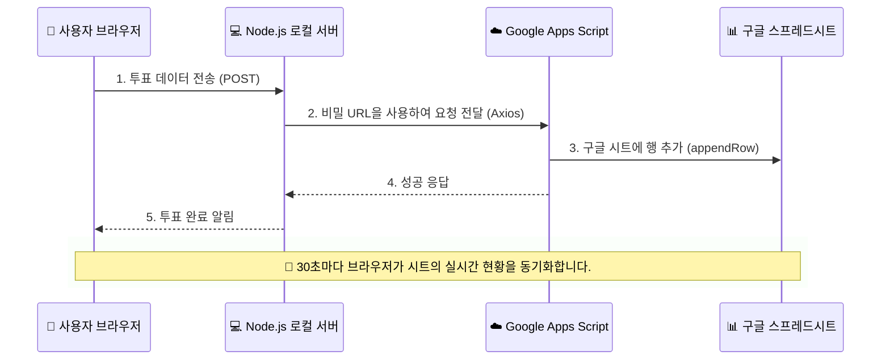

# 🚀 Antigravity - 단계별 웹 서비스 개발 프로젝트

이 저장소는 현대적인 디자인 감각과 실전 백엔드 연동 기술을 익히는 단계별 웹 개발 프로젝트를 담고 있습니다.

---

## 📂 프로젝트 구성 (Project Structure)

이 저장소는 현재 두 단계의 개별 프로젝트로 구성되어 있습니다.

### 🍱 [Course 2: 실시간 점심 메뉴 투표 서비스 (Lunch Vote Plus)](./course_2/)
오늘 점심 메뉴를 동료들과 실시간으로 투표하고 공유하는 세련된 서비스입니다.

-   **핵심 기능**:
    -   구글 스프레드시트와 실시간 연동 (Apps Script Web App 사용)
    -   데이터 유출 방지를 위한 로컬 Node.js 프록시 서버 구축
    -   낙관적 UI(Optimistic UI) 업데이트로 즉각적인 피드백 제공
    -   글래스모피즘 기반의 프리미엄 디자인 UI
-   **기술 스택**: HTML5, Vanilla CSS/JS, Node.js, Google Apps Script
-   **관련 문서**: 
    -   [인증 프로세스 및 연동 가이드](./course_2/Google_API_Auth_process.md)
    -   [프로젝트 상세 README](./course_2/README.md)

### 🎨 [Course 1: 반응형 레이아웃 파싱 및 테마 인터랙션](./course_1/)
동적인 인터랙션과 세련된 디자인 시스템을 통해 사용자 경험을 최적화하는 랜딩 페이지 프로젝트입니다.

-   **핵심 기능**:
    -   중앙 메인 카드의 동적 테마 컬러 체인징 버튼
    -   부드러운 애니메이션 효과와 Noto Sans KR 폰트 최적화
    -   모바일 환경에 완벽 대응하는 반응형 그리드 시스템
    -   카드 형태의 사용자 후기 섹션 구현
-   **기술 스택**: HTML5, Vanilla CSS, JS

---

## 🏗️ 전체 데이터 연동 플로우 (Architecture)

Course 2 프로젝트에서 구현된 안전한 구글 시트 연동 구조입니다.

---
Developed by **Joonmo Ahn** (2026)
