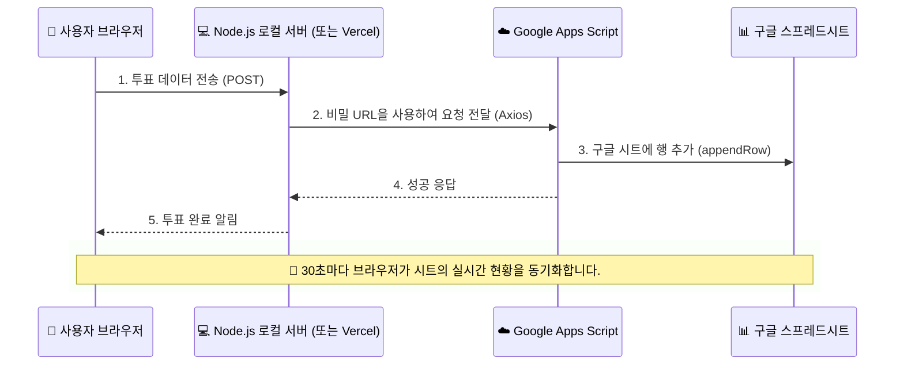

# 🚀 Antigravity - 단계별 웹 서비스 개발 프로젝트

본 저장소는 현대적인 디자인 감각과 실전 백엔드 연동 기술을 점진적으로 익혀나가는 단계별 프로젝트 폴더다.

---

## 📂 프로젝트 구성 (Project Structure)

현재까지 세 가지 프로젝트를 단계별로 구현 완료했다.

### 🧬 [Course 3: MBTI 성격유형 테스트 웹 앱 (Personality Test)](./course_3/)
8개 질문으로 내 진짜 MBTI를 확인하는 세련된 성격 테스트 프로젝트다.

-   **핵심 기능**:
    -   16개 질문 중 8개 랜덤 선택 및 선택지 순서 셔플 시스템 구현
    -   16가지 MBTI 유형별 고유 캐릭터 그래픽 자동 생성 및 로드
    -   깔끔하고 프리미엄한 라이트 모드 디자인 (글래스모피즘 반영)
    -   진행률 표시 바(Progress Bar) 및 부드러운 애니메이션 효과 적용
-   **기술 스택**: HTML5, Vanilla CSS/JS

### 🍱 [Course 2: 실시간 점심 메뉴 투표 서비스 (Lunch Vote Plus)](./course_2/)
오늘 점심 메뉴를 동료와 실시간으로 투표하고 공유하는 플랫폼이다.

-   **핵심 기능**:
    -   구글 스프레드시트와 실시간 데이터 동기화 (Apps Script 활용)
    -   데이터 유출 방지를 위한 로컬 Node.js 프록시 서버 구축
    -   낙관적 UI(Optimistic UI) 업데이트로 즉각적인 피드백 제공
    -   고급스러운 다크/화이트 모드 UI 지원 및 실시간 결과 데이터 반영
-   **기술 스택**: HTML5, Vanilla CSS/JS, Node.js, Google Apps Script
-   **관련 문서**: 
    -   [인증 프로세스 및 연동 가이드](./course_2/Google_API_Auth_process.md)
    -   [Vercel 배포 가이드 (강력 추천!)](./course_2/deployment_vercel.md)

### 🎨 [Course 1: 반응형 레이아웃 및 테마 인터랙션](./course_1/)
동적인 인터랙션과 세련된 디자인 시스템을 보여주는 랜딩 페이지 프로젝트다.

-   **핵심 기능**:
    -   메인 카드 클릭 시 테마 컬러가 동적으로 변하는 인터랙션 기능
    -   부드러운 애니메이션 효과와 Noto Sans KR 폰트 최적화
    -   모바일 환경에 완벽하게 대응하는 반응형 그리드 시스템 구축
-   **기술 스택**: HTML5, Vanilla CSS, JS

---

## 🏗️ 전체 데이터 연동 플로우 (Architecture)

Course 2에서 구현한 구글 시트 연동 보안 구조다.

---
Developed by **Joonmo Ahn** (2026)
