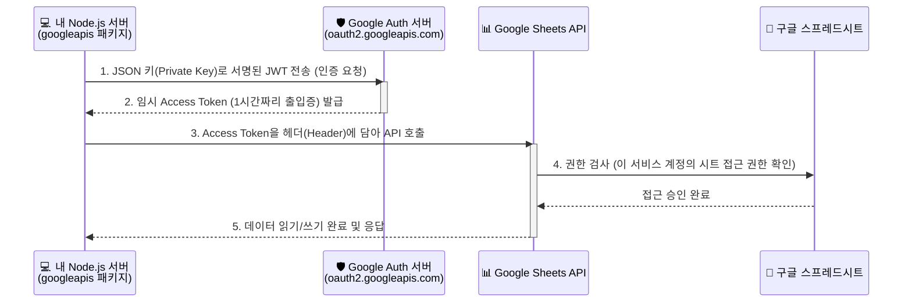
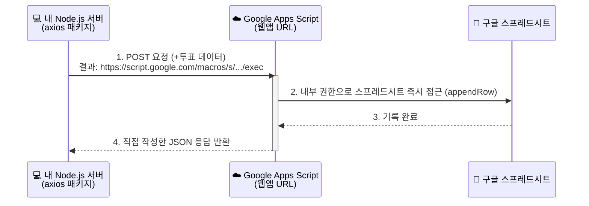

# 🔐 Google API 인증 및 로컬 연동 가이드 (종합본)

이 문서는 실시간 투표 서비스에 구글 스프레드시트를 연동하기 위해 사용하는 두 가지 방식(IAM 서비스 계정 vs 웹앱)을 비교하고, 실제 프로젝트를 로컬에서 연동 및 테스트하기 위한 구체적인 실행 가이드를 제공합니다.

---

## 🏗️ PART 1. 구글 API 인증 프로세스의 이해

### 1. Google Cloud IAM 기반 서비스 계정 (Service Account)

서버와 서버(Server-to-Server) 통신에서 가장 표준적이고 강력한 보안을 갖춘 방식입니다. (실제 상용 서비스 권장)

- **서비스 계정 (Service Account)**: 사람이 아닌 **'서버(애플리케이션)'를 위한 전용 가상 유저 계정**
- **JSON 키**: 이 가상 유저의 로그인 아이디/비밀번호 역할을 하는 고유한 인증서



### 2. Google Apps Script (Web App / Webhook)

본 프로젝트에 최종적으로 적용된 방식으로, 복잡한 통신 권한 설정 없이 개발자가 직접 만든 짧은 스크립트를 URL 형태로 노출(배포)하여 API처럼 쓰는 방식입니다. (토이 프로젝트 권장)



### 3. 실제 서비스에서는 무엇을 써야 할까? (장단점 비교)

| 구분 | Google Apps Script (웹앱) 🌐 | IAM 서비스 계정 (JSON) 🏢 |
| :--- | :--- | :--- |
| **적합한 용도** | 간단한 토이 프로젝트, 사내 어드민 툴 | **실제 상용 서비스, 트래픽이 많은 엔터프라이즈 앱** |
| **설정 난이도** | 매우 쉬움 (코드 몇 줄과 배포 클릭으로 끝) | 어려움 (GCP 콘솔 가입, 권한 부여, 키 관리 필요) |
| **보안 및 제어** | 낮음 (웹앱 URL 유출 시 누구나 호출 가능) | **매우 높음** (키 유출 위험 통제 가능) |
| **속도 및 성능** | 느림 (경유지가 추가되어 지연 시간 발생) | **빠름** (구글 서버와 다이렉트 통신) |
| **확장성** | 제한적 (초당 할당량 제한 빡빡함) | 무제한에 가까움 |
| **다른 API 연동**| 불가능 (구글 서비스 전용 문법) | 범용적 (타사의 무거운 API들도 이와 유사한 방식 채택) |

---

## 🚀 PART 2. 프로젝트 로컬 연동 및 실행 가이드

로컬 PC와 구글 시트 간의 실시간 투표 및 데이터 업데이트를 처리하기 위해 로컬 백엔드 서버를 설정했습니다. (현재 프로젝트는 **Part 1의 2번 방식인 Apps Script**를 사용합니다.)

### 1. 생성된 핵심 구성 요소
- **`server.js`**: 프론트엔드 파일 노출과 함께 `/api/vote` 경로를 프록시하여 CORS 문제를 해결하고 Apps Script 호출을 담당합니다.
- **`api/vote.js`**: 실제 구글 스프레드시트(웹앱 URL)에 POST 요청을 날리는 백엔드 핸들러입니다. (`axios` 사용)
- **`.env.example`**: 구글 웹앱 URL을 안전하게 저장하기 위한 환경 변수 템플릿 파일입니다.

### 2. 구글 Apps Script 연동 단계
이 서비스가 동작하기 위해서는 구글 스프레드시트에 웹앱 훅을 설치해야 합니다.
1. **구글 시트 열기**: 데이터가 기록될 구글 스프레드시트를 엽니다. (첫 번째 행: Timestamp, Menu, Voter 작성 권장)
2. **Apps Script 에디터**: 상단 메뉴 `확장 프로그램` ❯ `Apps Script`를 클릭합니다.
3. **코드 작성**: 기존 내용을 다 지우고 JSON을 해석하여 시트에 `appendRow`하는 `doPost(e)` 함수를 작성하고 저장합니다(💾).
4. **웹 앱 배포**: 우측 상단 `배포` ❯ `새 배포` ❯ `웹 앱(Web App)` 선택
   - **액세스 권한 설정**: "모든 사용자(Anyone)"로 설정 (가장 중요★)
   - 배포를 누르고 생성된 **웹앱 URL (https://script.google.com/...)** 복사.

### 3. 로컬 (.env) 설정 및 실행
1. 프로젝트 루트 경로의 `.env.example` 파일을 복사하여 `.env`로 이름을 변경합니다.
2. 2단계에서 복사한 웹앱 URL을 `.env` 안에 넣습니다.
   ```text
   GOOGLE_WEB_APP_URL="긴 웹앱 URL 붙여넣기"
   PORT=3000
   ```
3. 터미널을 열고 필요한 패키지를 설치한 뒤, 서버를 기동합니다.
   ```bash
   npm install
   npm start
   ```
4. 브라우저에서 `http://localhost:3000`으로 접속하여 투표가 원활하게 시트에 기록되는지 확인합니다.
