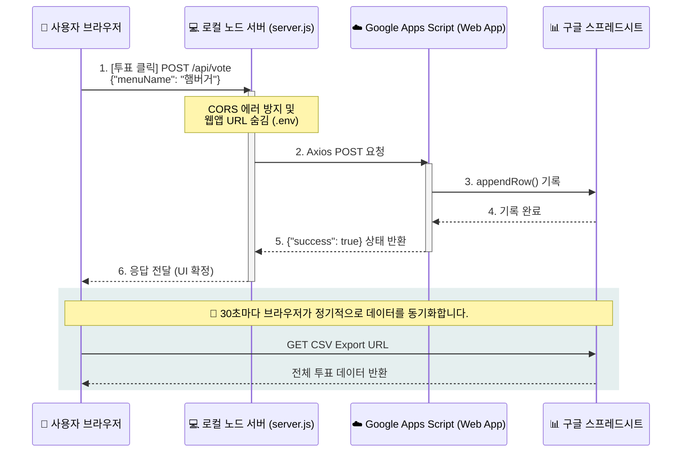

# 🍱 점심 메뉴 실시간 투표 서비스 (Lunch Vote Plus)

오늘 점심 뭐 먹지? 고민될 때 동료들과 함께 실시간으로 메뉴를 선택하고 결과를 확인할 수 있는 세련된 투표 서비스입니다. 구글 스프레드시트와 연동되어 데이터가 실시간으로 관리되며, 애니메이션 효과를 통해 즐거운 사용자 경험을 제공합니다.

---

## ✨ 주요 특징 (Features)

-   **실시간 투표 현황**: 구글 스프레드시트 데이터를 30초마다 자동으로 동기화하여 실시간 결과 반영.
-   **낙관적 UI 업데이트 (Optimistic UI)**: 투표 즉시 UI가 반응하여 응답 속도가 매우 빠름.
-   **프리미엄 디자인**: 글래스모피즘(Glassmorphism)과 반응형 레이아웃을 적용한 세련된 다크/화이트 모드 UI.
-   **구글 시트 연동**: 별도의 DB 없이 구글 Apps Script Web App을 통해 서버리스 DB 구축.
-   **로컬 테스트 지원**: Express 서버를 통해 로컬 환경에서 즉시 실행 및 테스트 가능.

## 🏗️ 아키텍처 및 플로우 차트 (Architecture & Flow)

이 프로젝트는 보안과 실시간성을 모두 잡기 위해 다음과 같은 구조로 투표가 이루어집니다.



## 🛠️ 기술 스택 (Tech Stack)

-   **Frontend**: HTML5, Vanilla CSS, Vanilla JavaScript
-   **Backend**: Node.js, Express (Local API Proxy)
-   **Database**: Google Sheets & Google Apps Script (Web App)
-   **Library**: `axios`, `cors`, `dotenv`, `body-parser`

---

## 🚀 빠른 시작 (Getting Started)

### 1. 사전 준비 (Prerequisites)
-   [Node.js](https://nodejs.org/) (v14 이상 권장)
-   구글 계정과 구글 스프레드시트

### 2. 설치 & 의존성 (Installation)
프로젝트 폴더에서 다음 명령어를 실행하여 필요한 패키지를 설치합니다.
```bash
npm install
```

### 3. 구글 Apps Script 설정 (Web App Deployment)
1.  **구글 시트 준비**:
    -   새 구글 시트를 생성하고, 첫 번째 행에 `Timestamp`, `Menu`, `Voter` 를 적어둡니다.
2.  **Apps Script 작성**:
    -   시트 상단 메뉴에서 `확장 프로그램 > Apps Script`를 클릭합니다.
    -   코드 편집기에 `doPost(e)` 함수 백엔드 코드를 작성합니다.
3.  **배포하기**:
    -   우측 상단 `배포 > 새 배포` 클릭 후 `웹 앱(Web App)`을 선택합니다.
    -   액세스 권한이 있는 사용자를 **'모든 사용자(Anyone)'**로 반드시 설정하고 배포합니다.
    -   생성된 긴 **웹앱 URL**을 복사합니다.

### 4. 환경 변수 설정 (Configuration)
`README.md`와 같은 위치에 `.env` 파일을 만들고 아래 내용을 입력합니다 (또는 `.env.example` 복사).
```env
GOOGLE_WEB_APP_URL="여기에_복사한_구글_웹앱_URL_붙여넣기"
PORT=3000
```

### 5. 실행 (Running)
로컬 서버를 구동합니다.
```bash
npm start
```
서버가 실행되면 브라우저에서 `http://localhost:3000`으로 접속하세요!

---

## 📂 프로젝트 구조 (Project Structure)

-   `index.html`: 메인 웹 UI 화면
-   `style.css`: 현대적이고 세련된 디자인 스타일링
-   `script.js`: 투표 상호작용 및 데이터 동기화 로직 (Frontend)
-   `api/vote.js`: 구글 시트에 데이터를 기록하는 백엔드 핸들러
-   `server.js`: 로컬 실행을 위한 Express 서버
-   `.env.example`: 환경 변수 설정 가이드

---

## 📝 라이선스 & 기타
이 프로젝트는 공부 목적으로 제작되었습니다. 자유롭게 포크(Fork)하고 기능을 추가해보세요!

-   **버전**: 1.0.0
-   **작성자**: [Joonmo Ahn]
-   **문의**: [사용자의 정보에 따른 문의처]

---
_오늘도 맛있는 점심 식사 되세요! 🥙💨_
